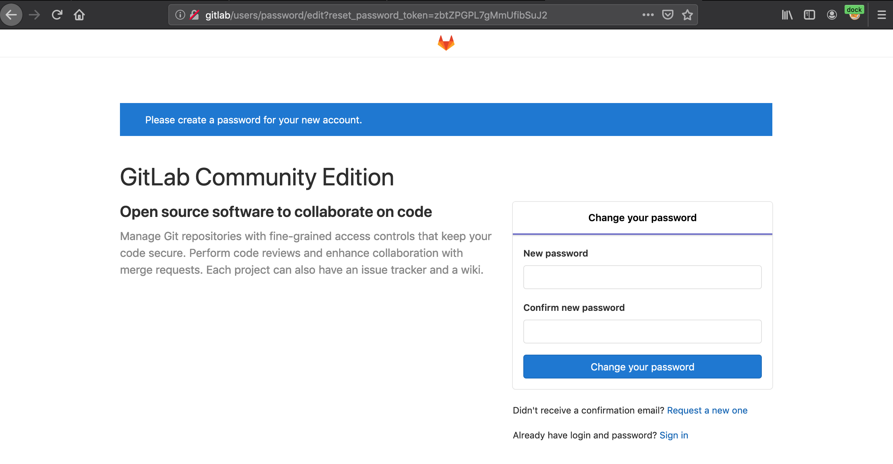
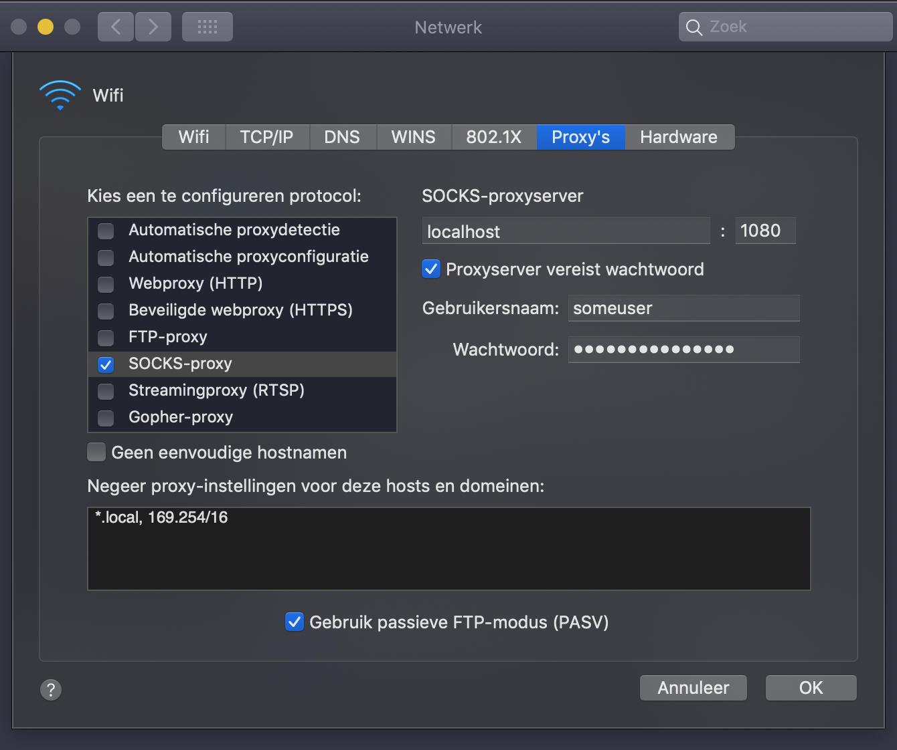
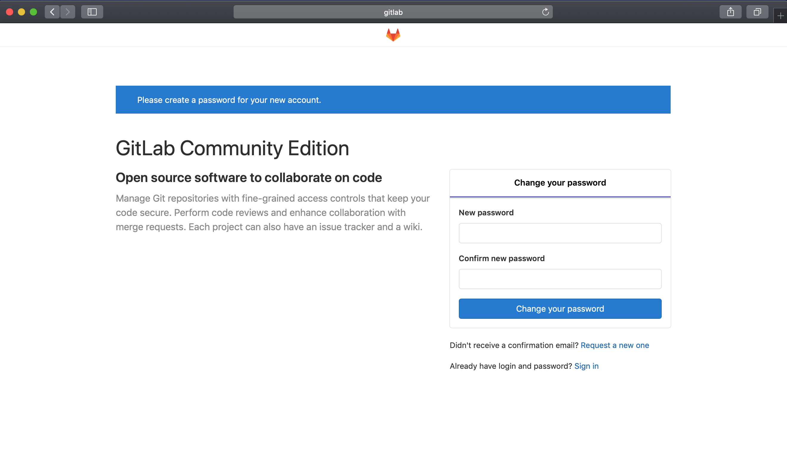

<a href="https://www.practical-docker.com"></a>

# https://www.practical-docker.com
This is the source code repository for <a href="https://www.practical-docker.com">https://www.practical-docker.com</a>

# episode 01: socks5-proxy vs. port forwarding
[https://github.com/marcelmaatkamp/practical-docker-episode-01-socks5-proxy](https://github.com/marcelmaatkamp/practical-docker-episode-01-socks5-proxy)

<a href="https://hub.docker.com/r/serjs/go-socks5-proxy"></a>
<a href="https://hub.docker.com/r/gitlab/gitlab-ce/"></a>

Opening and forwarding specific ports per docker container is ok for a few containers, the more ports you open the more it becomes a hasstle and totally not clear which ports map to which container. 

A simple but very effective solution is to use a socks5 proxy. In this episode I will show how to install and use a socks5 proxy and what benefits it brings to use this solution which is that each container can be reached by its internal hostname which is the name of the container.

Docker containers used:
 * [serjs/go-socks5-proxy](https://hub.docker.com/r/serjs/go-socks5-proxy)
 * [gitlab/gitlab-ce](https://hub.docker.com/r/gitlab/gitlab-ce/)


# Installation
```
$ git clone &&\ 
  cd  &&\
  docker-compose up -d
```
# Usage
Install a proxy switcher in your favorite browser (see below) and goto http://gitlab/

## Firefox

## Chrome/Chromium

## Mac/Safari

!(images/practical-docker-gitlab.png)

# Authentication
The socks5 proxy container also comes with username/password authentication. 

| setting | value |
| ------- | ----- |
| Protocol | Socks-proxy | 
| Socks Protocol-server | localhost | 
| Socks Protocol-port | 1080 | 
| username | someuser | 
| password | somepass|

# Google Chrome/Chromium
Beware: this is not available with Firefox and Google Chrome/Chromium because 'passwords are not transferred over a secure channel', see https://bugs.chromium.org/p/chromium/issues/detail?id=256785

## Firefox
Install the addon 'FoxProxy' 
https://addons.mozilla.org/en-US/firefox/addon/foxyproxy-standard/


And open http://gitlab/


## Mac/Safari
On a Mac Safari open "Network Settings -> Proxies" and enable the Socks-proxy:



Open Safari and goto http://gitlab/


# About
<a href="https://www.practical-docker.com"></a>

In these talks I will give practical tips and tricks on how to effectively use Docker as a valuable tool to solve various problems or just use it for fun projects with all kinds of hardware and software! See my [YouTube Channel with all episodes](https://www.youtube.com/channel/UCxp65f-xyu4z1PvmZBKqZGQ) for more information.
* [YouTube Channel with all episodes](https://www.youtube.com/channel/UCxp65f-xyu4z1PvmZBKqZGQ)
